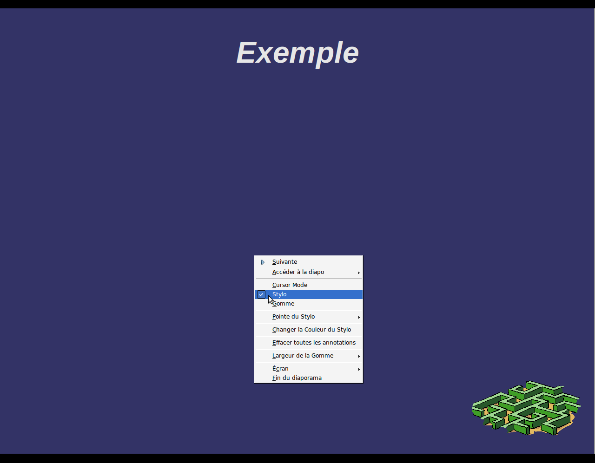
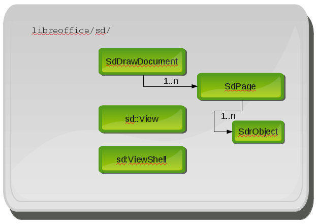

:Info: Développement du module d’annotation dans Office Impress
:Auteur: Clément Delafargue <clement@delafargue.name>
:Auteur: Benjamin Vialle <benjamin@vialle.eu>
:Revision: $Revision: 2 $
:Date: $Date: 9-14 juillet 2011 $

================================================================================
Développement du module d’annotation dans Office Impress
================================================================================

.. présentation d'educooo ?

L'École Centrale de Nantes et le Libre
================================================================================

MarkUs
--------------------------------------------------------------------------------

.. Je ne suis pas sure qu'il soit bien de mentionner markus ici. Ne mélangeons
   pas les choux et les carottes :]

- Utilisation de MarkUs pour améliorer l'enseignement de l'informatique
- Projets scolaires d'ajout de fonctionnalités au logiciel

OpenOffice.org / OpenOffice4Kids
--------------------------------------------------------------------------------

- Concours HP - 21 Tablet PCs gagnés en 2008
- Projets étudiants pour proposer un cartable électronique libre
  - Utilisation de Gnu/Linux
  - Amélioration d'OpenOffice.org Impress pour les Tablet-PCs

- OOo4Kids :
   un logiciel de bureautique libre et gratuit pour les 7-12 ans basé sur les
   sources du logiciel OpenOffice.org volontairement très simplifié et adapté
   aux programmes d'enseignement.

Le module annotations d'Impress
================================================================================

Dans les épisodes précédents
--------------------------------------------------------------------------------
.. Pourquoi diviser tout le travail ? Le module d'annotation d'impress
   correspond à *tous* les projets étudiants de centrale nantes. Pas seulement le
   votre. A priori, le titre de la conférence n'est pas "Dev du module
   d'annotation dans O4k lors de l'année 2011".
   A priori, je pense qu'il faut tout présenter comme un bloc.

3 groupes d'étudiants ont ajouté plusieurs fonctionnalités depuis 2008 :
  - Ajout
  - Ajout d'une fonction Gomme
  - Choix de la couleur / taille du crayon

.. figure:: images/screenshot_021.png
   :width: 1200px

Notre projet
--------------------------------------------------------------------------------
- Ajouter un mode de fonctionnement (le mode curseur)
- Rendre le code plus extensible (avoir la possibilité d'autres modes)

En détail
--------------------------------------------------------------------------------
- Ajouter un mode «pointeur» (montrer les diagrammes d'état)
- Rendre le code un peu plus évolutif (bool -> enum)
- Intégrer notre travail au sein du code -> comprendre l'architecture du
  module, les différentes couches et leurs modes de communication
- Modification de l'interface graphique pour intégrer un nouveau bouton,
  internationalisation du code

Cadre technique
================================================================================

Méthodes de modélisation
--------------------------------------------------------------------------------
Workflow proche de la programmation agile (XP Programming)

* Écriture d'un cahier des charges 
* Retours réguliers avec le client (mentor technique)
* itérations rapides (une semaine)

Démarche de développement
--------------------------------------------------------------------------------

Structure complexe, nécessité d'impacts localisés

* Lecture du code, réalisation de diagrammes décrivant la structure
* Isolement de la partie à modifier
* Modification, en procédant par mimétisme

.. une meilleure image est le schéma d'Olivier, repris dans notre rapport avec
  la description des modules

Contraintes de génie logiciel
--------------------------------------------------------------------------------

Phase de conception préliminaire validée par le mentor et l'encadrant.
Modélisation rigoureuse de la fonctionnalité à ajouter.

Procédure de documentation
--------------------------------------------------------------------------------

* Utilisation du wiki d'OpenOffice4Kids pour avoir une base de documentation et
  la compléter

* Documentation en anglais

.. http://wiki.ooo4kids.org/index.php/User:Bvialle

Assurance qualité
--------------------------------------------------------------------------------

.. cough, cough... Je suis très honorée, mais à mon avis, on peut enlever
  "revu de code par des anciens élèves". J'en ai fait une seule, et elle a
  servie à rien.

Revue de code dans le groupe, par des anciens élèves, et par Éric.
Nécessité de produire des *patches* courts et lisibles pour faciliter la
relecture.

Cadre pédagogique
================================================================================

.. Je ne suis pas sure que cette partie soit "utile". On parle principalement
   de développement ici. Si on garde un partie "cadre pédagogique", je pense
   qu'il faut insister sur ce qui est propre à OOo

Tuteur enseignant
--------------------------------------------------------------------------------
Morgan Magnin, E/C à l'École Centrale de Nantes.

- Rédaction de comptes-rendus toutes les deux semaines
- Réunion toutes les deux semaines
- Rapport de fin de projet

Mentor technique
--------------------------------------------------------------------------------
Éric Bachard, professeur à l'UTBM

- Réunion sur IRC une fois par semaine
- Détails techniques
- Marche à suivre

Vertus de l'approche choisie
================================================================================

Difficultés
--------------------------------------------------------------------------------
- Temps de compilation importants
- Base de code de qualité inégale

Apports
--------------------------------------------------------------------------------
- Contribution à un projet libre
- Travail sur un gros projet impossible à comprendre en entier
- Communication quasi exclusivement via IRC
- Il reste encore du travail

- Soumission de patches pour pour OOo4k et OOo (et LO)
