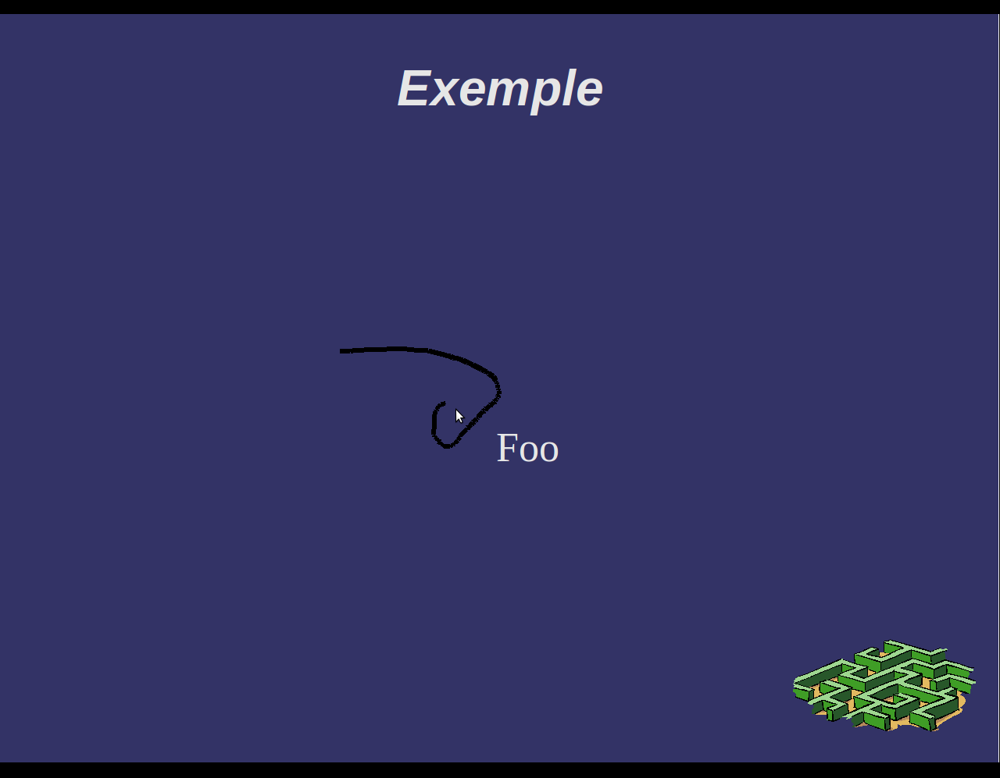

:Info: Le cercle vertueux de la participation d'étudiants à des projets libres
:Auteur: Clément Delafargue <clement@delafargue.name>
:Auteur: Benjamin Vialle <benjamin@vialle.eu>
:Revision: $Revision: 2 $
:Date: $Date: 9-14 juillet 2011 $

================================================================================
Le cercle vertueux de la participation d'étudiants à des projets libres
================================================================================

L'École Centrale de Nantes et le Libre
================================================================================

MarkUs
--------------------------------------------------------------------------------

- Utilisation de MarkUs pour améliorer l'enseignement de l'informatique
- Projets scolaires d'ajout de fonctionnalités au logiciel

OpenOffice.org / OpenOffice4Kids
--------------------------------------------------------------------------------

- Concours HP - 21 Tablet PCs gagnés en 2008
- Projets étudiants pour proposer un cartable électronique libre
  - Utilisation de Gnu/Linux
  - Amélioration d'OpenOffice.org Impress pour les Tablet-PCs

- OOo4Kids :
   un logiciel de bureautique libre et gratuit pour les 7-12 ans basé sur les
   sources du logiciel OpenOffice.org volontairement très simplifié et adapté
   aux programmes d'enseignement.

Le module annotations d'Impress
================================================================================

Dans les épisodes précédents
--------------------------------------------------------------------------------
3 groupes d'étudiants ont ajouté plusieurs fonctionnalités depuis 2008 :
  - Ajout
  - Ajout d'une fonction Gomme
  - Choix de la couleur / taille du crayon

Notre projet
--------------------------------------------------------------------------------
- Ajouter un mode de fonctionnement (le mode curseur)
- Rendre le code plus extensible (avoir la possibilité d'autres modes)

.. figure:: images/screenshot_020.png
   :width: 1200px

En détail
--------------------------------------------------------------------------------
- Ajouter un mode «pointeur» (montrer les diagrammes d'état)
- Rendre le code un peu plus évolutif (bool -> enum)
- Intégrer notre travail au sein du code -> comprendre l'architecture du
  module, les différentes couches et leurs modes de communication
- Modification de l'interface graphique pour intégrer un nouveau bouton,
  internationalisation du code

Cadre technique
================================================================================

Méthodes de modélisation
--------------------------------------------------------------------------------
Workflow proche de la programmation agile (XP Programming)

* Écriture d'un cahier des charges 
* Retours réguliers avec le client (mentor technique)
* itérations rapides (une semaine)

Démarche de développement
--------------------------------------------------------------------------------
?

Contraintes de génie logiciel
--------------------------------------------------------------------------------

?

Procédure de documentation
--------------------------------------------------------------------------------

* Utilisation du wiki d'OpenOffice4Kids pour avoir une base de documentation et
  la compléter

* Documentation en anglais

.. http://wiki.ooo4kids.org/index.php/User:Bvialle

Assurance qualité
--------------------------------------------------------------------------------

Cadre pédagogique
================================================================================

Tuteur enseignant
--------------------------------------------------------------------------------
Morgan Magnin, E/C à l'École Centrale de Nantes.

- Rédaction de comptes-rendus toutes les deux semaines
- Réunion toutes les deux semaines
- Rapport de fin de projet

Mentor technique
--------------------------------------------------------------------------------
Éric Bachard, professeur à l'UTBM

- Réunion sur IRC une fois par semaine
- Détails techniques
- Marche à suivre

Vertus de l'approche choisie
================================================================================

Difficultés
--------------------------------------------------------------------------------
- Temps de compilation importants
- Base de code de qualité inégale

Apports
--------------------------------------------------------------------------------
- Contribution à un projet libre
- Travail sur un gros projet impossible à comprendre en entier
- Communication quasi exclusivement via IRC
- Il reste encore du travail

- Soumission de patches pour pour OOo4k et OOo (et LO)
